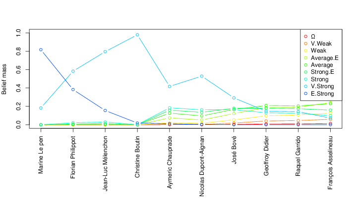

    ###                                         
    ###     _____     ___ _                     
    ###    |     |___|  _| |_ _ ___ ___ ___ ___ 
    ###    |-   -|   |  _| | | | -_|   |  _| -_|
    ###    |_____|_|_|_| |_|___|___|_|_|___|___|
    ###                                         
    ###                                                          
    ###     _____                                   _      _     
    ###    |  _  |___ ___ ___ ___ ___ _____ ___ ___| |_   |_|___ 
    ###    |     |_ -|_ -| -_|_ -|_ -|     | -_|   |  _|  | |   |
    ###    |__|__|___|___|___|___|___|_|_|_|___|_|_|_|    |_|_|_|
    ###                                                          
    ###                                   
    ###     _____       _ _   _           
    ###    |_   _|_ _ _|_| |_| |_ ___ ___ 
    ###      | | | | | | |  _|  _| -_|  _|
    ###      |_| |_____|_|_| |_| |___|_|  
    ###
    ###
    ###   by Sergey Kirgizov, Lobna Azaza, Nicolas Gastineau and Marinette Savonnet
    ###   2015, Le2i, Université de Bourgogne
    ###
    ###
    ###   The Source code for paper "Influence Assessment in Twitter Multi-Relational Network"
    ###             written by Lobna Azaza, Sergey Kirgizov, Marinette Savonnet, Eric Leclercq

## The Source code for paper "Influence Assessment in Twitter Multi-Relational Network"
##             written by Lobna Azaza, Sergey Kirgizov, Marinette Savonnet, Eric Leclercq

## 

 
# TODO

* add a link to the paper
* add examples of how to use the code to this README.md
* transform this code to true R package